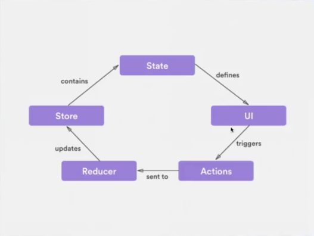

# Apuntes del curso de Redux en Platzi

Estos son los apuntes del curso de Redux de Platzi.

Tabla de Contenido

- [Apuntes del curso de Redux en Platzi](#apuntes-del-curso-de-redux-en-platzi)
  - [¿Qué es Redux?](#%C2%BFqu%C3%A9-es-redux)
  - [Motivacción para crear Redux](#motivacci%C3%B3n-para-crear-redux)
  - [Componentes de Redux](#componentes-de-redux)
  - [Ciclo Redux](#ciclo-redux)
  - [Principios para trabajar con Redux](#principios-para-trabajar-con-redux)
  - [Entendiendo un Store](#entendiendo-un-store)
    - [Forma de usar un Store en código](#forma-de-usar-un-store-en-c%C3%B3digo)
  - [Entendiendo un Action](#entendiendo-un-action)
    - [Forma de usar un Action en código](#forma-de-usar-un-action-en-c%C3%B3digo)
  - [Entendiendo un Reducer](#entendiendo-un-reducer)
    - [Nunca hagas esto con un Reducer](#nunca-hagas-esto-con-un-reducer)
    - [¿Qué es una Función Pura?](#%C2%BFqu%C3%A9-es-una-funci%C3%B3n-pura)
    - [Forma de usar un Reducer en código](#forma-de-usar-un-reducer-en-c%C3%B3digo)
  - [Resumen del flujo de eventos](#resumen-del-flujo-de-eventos)

## ¿Qué es Redux?

Es un __contenedor__ del estado predecible para nuestras aplicaciones _JavaScript_. Es una librería creada por [@dan_abramov](https://github.com/gaearon), para _manipular_ los datos de una forma _separada_ de la interfaz, similar a lo que hace __webpack__ con la opción _hot-reload_.

## Motivacción para crear Redux

El Front-End es muy complejo.

## Componentes de Redux

__Store:__ Es el centro y la verdad de todo, con métodos para actualizar, obtener y escuchar datos.

__Actions:__ Son bloques de información que envian datos desde la aplicación hacia el store.

__Reducers:__ Cambian el estado de la aplicación.

## Ciclo Redux



Por tanto __Redux__ es una implementación del patrón de _“Observer”_. El _store_ de redux es en sí, la forma específica de cómo se lleva a cabo. Un _store_ mantiene el árbol de estado _(state tree)_ de tu aplicación. Si quieres cambiar el estado dentro del _store_, es necesario que hagas un dispatch sobre él.

__Redux__ permite centralizar y tener control total de las modificaciones de los datos almacenados en el estado de mi aplicación, para saber siempre, en todo momento, quíen, como, cuando y por qué han cambiado mis datos

## Principios para trabajar con Redux

> _Redux_ debe utilizarse de una manera __responsable__, para no caer en el error de aplicar sobre ingeniería (exceso de complejidad) a tus aplicaciones sencillas … eso sería contraproducente a lo que intenta resolver _Redux_.

- __Única fuente de verdad:__

El estado de toda tu aplicación esta almacenado en un _árbol_ guardado en un único _store_ lo que hace mas fácil el proceso de depuración.

> Por cada aplicación (especialmente las de tipo single page), deberías tener un solo store, excepto si tienes múltiples páginas, donde cada página por conveniencia pudiera manejar su propia store.

- __Solo Lectura:__

La única forma de _modificar el estado_ es emitiendo una _acción_, un objeto que describe que ocurrió.

- __Los cambios se realizan con funciones puras:__

Los reducers son _funciones puras_ que toman el estado anterior y una acción, y _devuelven un nuevo estado_.

> Dentro de los principios de la programación funcional, una función pura, es aquella que únicamente devuelve un resultado a partir de sus parámetros, y no hace nada más que eso, no modifica estados, no dispara eventos, etc.

__Redux <3 React.__ Puedes utilizarlo con _VanillaJS_ o con cualquier otra librería o framework ([_Vue_](https://vuejs.org/v2/guide/state-management.html), [_Angular_](https://github.com/angular-redux/ng-redux) o hasta con [_jQuery_](https://github.com/mkamakura/redux-jquery)).

## Entendiendo un Store

__Store:__ Es la parte más importante de entender cuando estamos haciendo algo en _Redux_.

- Datos importantes del Store:

  - Contiene el estado de la aplicación
  - Se puede acceder al estado con el método __getState()__
  - Se puede actualizar el estado con el método __dispatch(action)__
  - Escucha cambios con el método **__subscribe(listener)__
  - Deja de escuchar cambios retornando la función del método __subscribe(listener)__

### Forma de usar un Store en código

```javascript
Import { createStore } from 'redux';
```

1. __Reducer:__ función pura que retorna el próximo estado
2. __PreloadState / InicialState:__ es el estado inicial de la aplicación, la primera carga, el llamado a una data. Puede ser cualquier tipo de dato.
3. __Enhancer:__ función que puede extender redux con capacidades añadidas por librerías externas. Es opcional.

    _Ejemplo: Añadir las dev-tools_

Al momento de utilizarlo, se hace de la siguiente manera:

```javascript
const store = createStore(
  reducer,
  initialState,
  enhancer
)
```

Para adquirir los valores que hay dentro del store, se usa el método _store.getState()_. De esta manera puedes ahora hacer uso del contenido del state para lo que quieras.

## Entendiendo un Action

__Action:__ Es un bloque de información que envía datos a la aplicación.

- Datos importantes del Action:

  - Se envía usando el método __dispatch()__ del __store__
  - Son la única fuente de información del __Store__
  - Son objetos planos de __JavaScript__

### Forma de usar un Action en código

Ejemplo de un objeto plano de JavaScript:

```javascript
store.dispatch({
    type: 'ADD_SONG', // Único elemento obligatorio type, definiendo un string con mayúsculas y _ para separar
    payload: 'Dios de Milagros' // Opcional
  }
)
```

## Entendiendo un Reducer

__Reducer:__ Este es el que modifica el estado.

- Datos importantes del Reducer:

  - Es una _función_
  - Puede haber más de un __reducer__ en una aplicación pero solo debe haber un __store__
  - Devuelve el siguiente estado

### Nunca hagas esto con un Reducer

- Modificar sus argumentos
- Realizar tareas con efectos secundarios como llamasdos a APIs
- Llamar a funciones no puras como __Date.now()__ o __Math.random()__

### ¿Qué es una Función Pura?

Es un concepto y columna vertebral de la programación funcional, que hace que el código sea más legible. Cumple con dos condiciones:

1. Dados los mismos datos de entrada, deben retornar el mismo resultado sin importar el número de veces que se llame.
2. No debe tener objetos secundarios.

### Forma de usar un Reducer en código

Ejemplo de un objeto plano de JavaScript:

```javascript
const reducer = function (
  state,
  action
) {
  // Lo que voy a hacer con el estado y la acción
}
```

Lo que nos lleva a un ejemplo aplicado de la siguiente manera:

```javascript
const reducer = function (state, action) {
  // Lo que voy a hacer con el estado y la acción
  switch (action.type) {
    case 'ADD_SONG':
      return [...state, { title: action.payload }]
    default:
      return state
  }
}
```

## Resumen del flujo de eventos

- Se establece un __State__ (estado) inicial con el que se crea originalmente el __store__ mediante el método _createStore_ de __redux__
- El state inicial define los contenidos que se muestran en la UI mediante __store.getState()__ y la función __render()__
- Mediante los elementos de la UI se dispara un evento que se captura mediante un listener (como _onsubmit_) y que invoca al __store.dispatch()__ con una acción específica...
- El Reducer recibe la acción(_type_ y _payload_) enviada mediante el __store.dispatch()__ y genera un nuevo estado que remplazará al estado inicial (o anterior)
- El cambio del estado es detectado por el __store__ y se ejecuta __store.subscribe(handle)__, con la función (_handle_) que manejará lo que sucede cuando ha cambiado el estado
- En la función (_handle_) recibida por __store.subscribe(handle)__ se invoca la actualización de la UI a partir del nuevo estado creado
- Queda establecido el nuevo __estado(state)__ y queda de nuevo atento el evento (_listener_) en la UI